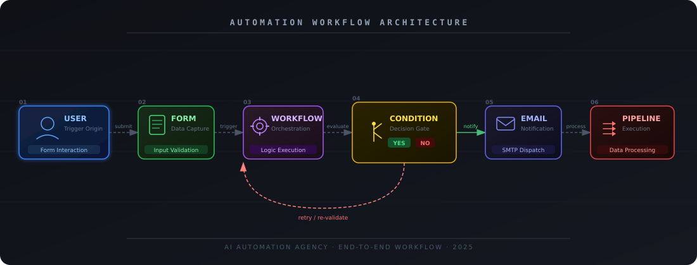

<div align="center">

# AI-Powered Lead Automation System

**End-to-end lead capture, classification, and nurturing pipeline built on GoHighLevel.**

[](https://www.gohighlevel.com/)
[](.)
[](.)
[](https://github.com/Sameershahh)

</div>

---

## Overview

This project implements a fully automated lead management pipeline that captures inbound leads, classifies them by intent, routes them through conditional logic, and triggers personalized follow-up sequences — with zero manual intervention.

Built on **GoHighLevel (GHL)**, it replicates how modern AI-driven sales pipelines operate: instant response, structured qualification, and consistent nurturing at scale.

---

## Problem Statement

Traditional lead handling is slow, inconsistent, and heavily manual. Common failure points:

- Response delays that cost conversions
- No structured qualification — every lead treated the same
- Follow-ups missed due to human error
- No visibility into pipeline stage or lead status

---

## Demo


> **Walkthrough Form:** [Form](https://api.leadconnectorhq.com/widget/form/JJva1d9L07FOOPQEvzsH?notrack=true)

Covers:
- Live form submission
- Workflow execution in GHL
- Email receipt confirmation
- Pipeline card movement (Cold → Hot)

---

## Solution Architecture


<div align="center">


*Full pipeline — from lead submission to pipeline tracking*

</div>

The system is structured across six sequential stages:

```
User Input
    └─► Lead Capture Form
            └─► Workflow Trigger
                    └─► Condition Logic  ──► HOT Lead ──► Personalized Email + Pipeline Update
                                        └─► COLD Lead ──► Nurture Sequence + Tag Assignment
```

---

## Workflow Breakdown

### Stage 1 — Lead Submission

The user fills out a dynamic capture form embedded on a landing page or funnel. On submission, structured data is passed to the GHL workflow engine.

<!-- ==========================================================
     SCREENSHOT: GHL form builder / embedded form UI
     ========================================================== -->


---

### Stage 2 — Workflow Trigger

Form submission fires a GHL workflow trigger. The workflow picks up the payload and begins executing the defined automation sequence.

<!-- ==========================================================
     SCREENSHOT: GHL Workflow canvas showing trigger node
     ========================================================== -->


---

### Stage 3 — Lead Classification (Condition Logic)

Rule-based conditions evaluate the lead's intent using keyword signals and field values.

| Signal | Classification | Action |
|---|---|---|
| Keywords: "buy", "price", "interested", "service" | HOT Lead | Priority pipeline + immediate email |
| No strong intent signal | COLD Lead | Nurture sequence + tag assignment |


---

### Stage 4 — Tag Assignment & Pipeline Routing

Based on classification, the lead is:
- Tagged (`hot_lead` / `cold_lead`) for segmentation
- Moved to the corresponding pipeline stage in GHL CRM


---

### Stage 5 — Automated Email Response

A personalized email is dispatched immediately based on lead type. Templates are dynamically populated with the lead's submitted data (name, service interest, etc.).


---

### Stage 6 — Follow-Up Automation

Time-delayed follow-up sequences are triggered automatically:
- HOT leads: follow-up at 24h, 48h
- COLD leads: re-engagement drip over 7 days

---


## Tech Stack

| Component | Tool |
|---|---|
| CRM & Automation Platform | GoHighLevel (GHL) |
| Form & Funnel Builder | GHL Native Forms |
| Workflow Engine | GHL Automation Workflows |
| Email System | GHL Email Templates + SMTP |
| Lead Segmentation | GHL Tags & Smart Lists |
| Pipeline Management | GHL CRM Pipelines |

---

## Project Structure

```
ghl-lead-automation/
├── assets/
│   ├── architecture.png        # Architecture diagram
│   └── screenshots/
│       ├── 01-form.png
│       ├── 02-workflow.png
│       ├── 03-email.png            # GHL configuration steps
└── README.md
```

---


## Business Impact

| Metric | Before Automation | After Automation |
|---|---|---|
| Response Time | Hours / Days | Instant |
| Lead Qualification | Manual | Rule-based, automated |
| Follow-Up Consistency | Inconsistent | 100% systematic |
| Manual Workload | High | Near zero |

---

## Key Learnings

- Designing conditional automation trees in GHL workflows
- Implementing rule-based lead scoring without a dedicated ML model
- Structuring CRM pipelines for visibility and conversion tracking
- Building scalable nurture sequences with time-based triggers

---

## Roadmap

- [ ] Integrate AI-based lead scoring via OpenAI/Gemini API
- [ ] Add WhatsApp / SMS automation using GHL + Twilio
- [ ] Build a custom analytics dashboard (pipeline velocity, conversion rate)
- [ ] Chatbot-based lead capture on landing page

---

## Author

**Sameer Shah** — AI Automation Engineer & Full-Stack Developer

[GitHub](https://github.com/Sameershahh) · [LinkedIn](https://www.linkedin.com/in/sameershah-dev/)
